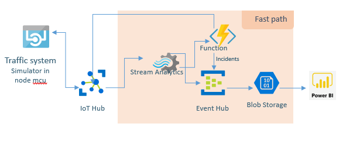

# tietoEVRY-Innovators
#Team Name *  tietoEvryInnovators 
#Team Organization * tietoEvry

With the advancement in IoT, there are enough resources to collect Traffic data using sensing devices and image processing systems, 
various parameters have to be calculated in order to estimate the accurate density of a particular type of vehicle in real-time which can 
be further utilized to formulate an intelligent adaptive traffic control system.The proposed system classified the real-time traffic in a lane 
on road into virtual sub lanes and then allots different traffic lights intervals for different virtual sub lanes.Thus, each virtual lane is allotted
variable traffic signal intervals based on real-time traffic density of that particular type of vehicle in each virtual lane.

This avoids unnecessary waiting time for one type of vehicle in one virtual sub lane due to the density of vehicles in another virtual lane.
By categorizing the traffic in each virtual sub lane and sensing real-time vehicle density of the lane the intervals of traffic lights at each crossing of 
the road can be intelligently decided and varied in order to intelligently adaptively control the traffic system. 

Thus optimization of the traffic control systems increases road capacity saves time for traveling and prevents traffic congestion and reduces carbon. Azure Deployment Architecture is as shown below

1.Refer Arduino code for Traffic System simulator. 

2.Refer the power BI graph for sample output. < https://app.powerbi.com/groups/me/reports/ab47db1c-eb3e-41d4-8774-d04486ff6540/ ReportSection1054c37506dea79ac03e> 

